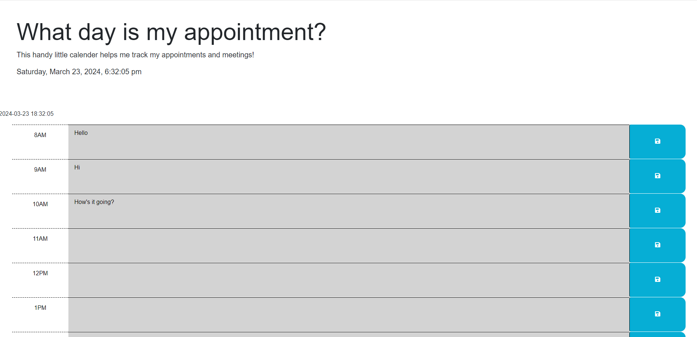

# WhatDayIsMyApp-
Day planner
Description
Welcome to the Day Scheduler! In this app, you will be able to keep track of your hour to hour appointments. You will be able to save inputs so that should the page refresh, your data will still be there. The time blocks also change color of the time blocks also change color with the hour. Past times blocks will appear grey, current hour block will appear red, while future blocks will appear green.

Features
Save feature for when the page refreshes
Time blocks that change color so that you always know what hour it is

Reset the game
Languages Used
jQuery
AJAX
JavaSCript
CSS
HTML
User Story

AS AN employee with a busy schedule
I WANT to add important events to a daily planner
SO THAT I can manage my time effectively

Acceptance Criteria
GIVEN I am using a daily planner to create a schedule
WHEN I open the planner
THEN the current day is displayed at the top of the calendar
WHEN I scroll down
THEN I am presented with time blocks for standard business hours of 9am to 5pm
WHEN I view the time blocks for that day
THEN each time block is color-coded to indicate whether it is in the past, present, or future
WHEN I click into a time block
THEN I can enter an event
WHEN I click the save button for that time block
THEN the text for that event is saved in local storage
WHEN I refresh the page
THEN the saved events persist

The Result

